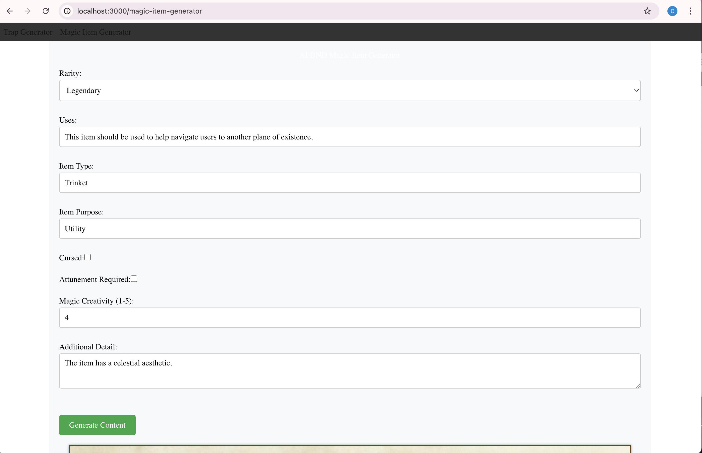

# D&D AI Webapp

This project is a work-in-progress webapp for generating custom entities for D&D games.

## Getting Started

### Prerequisites

Ensure you have Node.js installed. We recommend using the latest LTS version.

### Installation

1. **Clone the Repository**:

   ```bash
   git clone [https://github.com/christophermtn/dnd-ai-webapp.git](https://github.com/christophermtn/dnd-ai-webapp.git)
   cd dnd-ai-webapp
   ```

2. **Install Dependencies**:

   ```bash
   npm install
   ```

3. **Running the Development Server**:

   ```bash
   npm run dev
   ```

   Open [http://localhost:3000](http://localhost:3000) in your browser to view the app. The page will auto-update as you make edits.

4. **Configuration**:

   You will have to add a .env file containing API keys and other configuration to get the app to run. Please see the .env.example for details.

5. **Example**:

   This is an example of the magic item generation page taken December 10th, 2024:

   
   
